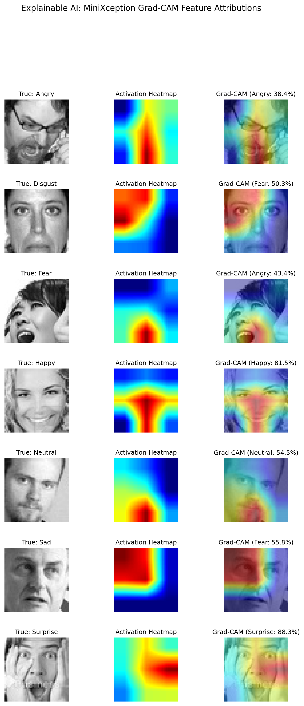

# 🎭 EdgeVision: Real-Time Facial Emotion & Driver Fatigue Guard

[](https://github.com/shahin13700/fer-emotion-recognition/actions)
[](https://opensource.org/licenses/MIT)
[](https://www.python.org/)
[](https://tensorflow.org/)
[](https://developers.google.com/mediapipe)
[](https://gradio.app/)
[]()

An ultra-lightweight computer vision pipeline for **real-time facial emotion recognition**, **gamified peak expression tracking**, and **driver drowsiness monitoring** at 60+ FPS on consumer CPUs—requiring **zero GPU** for deployment.

Powered by a compact **MiniXception CNN** (~60,000 parameters, 817 KB) trained with cost-sensitive class weights, stabilized by **Exponential Moving Average (EMA) temporal smoothing**, and integrated with **Google MediaPipe 3D Face Mesh** (468 landmarks).

---

## 🌟 Key Features

- ⚡ **Sub-10ms Edge Inference:** MiniXception uses depthwise separable convolutions to reduce parameters by ~8x compared to standard convolutions. Model size is only **817 KB**.
- 📸 **7-Emotion Photo Booth Challenge:** Interactive webcam challenge that tracks your peak expressions across all 7 emotions using **empirical confidence thresholds** and exports a downloadable **Emotion Photo Strip**.
- 💾 **Local Active Learning & Personal Dataset Builder:** Save verified webcam portraits locally to `dataset/user_contributed/metadata.jsonl` to tailor the model to your camera, lighting, and facial traits.
- 🛡️ **Guardrailed Fine-Tuning (`fine_tune.py`):** Blended data generator that combines user data with base training data, enforces a minimum 10 samples/class gate, heavy data augmentation, and test set rollback protection if accuracy drops.
- 👁️ **Fatigue & Drowsiness Guard:** Real-time **Eye Aspect Ratio (EAR)** calculation via 468 3D facial landmarks detects eye closure and micro-sleeps.
- 🎯 **Temporal Smoothing:** Exponential Moving Average (EMA) across consecutive video frames eliminates erratic label flickering.
- 🧠 **Explainable AI (Grad-CAM):** Visualizes neural network activation heatmaps to verify that predictions rely on valid facial action units.
- 🌐 **Interactive Web App (Gradio):** Multi-modal web UI with live streaming, video processing, and photo booth, ready for **Hugging Face Spaces**.

---

## 📊 Benchmark Evaluation & Empirical Thresholds

Evaluated on **7,178 test images** from the FER2013 benchmark dataset:

| Emotion | Precision | Recall | F1-Score | Support | Live Capture Gate | Key Facial Signals |
| :--- | :---: | :---: | :---: | :---: | :---: | :--- |
| **Happy** | **0.81** | **0.78** | **0.79** | 1,774 | **0.70** | Distinctive smile, raised cheeks |
| **Surprise** | **0.68** | **0.71** | **0.70** | 831 | **0.65** | Raised eyebrows, open mouth |
| **Disgust** | 0.34 | **0.64** | 0.45 | 111 | **0.50** | Wrinkled nose (class-weighted) |
| **Neutral** | 0.48 | 0.63 | 0.54 | 1,233 | **0.46** | Resting facial posture |
| **Angry** | 0.45 | 0.54 | 0.49 | 958 | **0.46** | Lowered eyebrows, tightened lips |
| **Sad** | 0.48 | 0.40 | 0.43 | 1,247 | **0.37** | Downturned lip corners |
| **Fear** | 0.43 | 0.24 | 0.31 | 1,024 | **0.38** | Widened eyes (often confused with Surprise) |

- **Test Accuracy:** **57.15%** (Competitive baseline on FER2013 for a lightweight 60k parameter model).
- **Capture Gates:** Derived from the 25th percentile of correct test predictions to calibrate webcam sensitivity per emotion.

---

## 🔬 Explainable AI: Grad-CAM Feature Attributions

`explain.py` generates **Gradient-weighted Class Activation Mapping (Grad-CAM)** heatmaps to confirm the network focuses on biologically plausible facial regions (mouth corners for *Happy*, brow furrowing for *Angry*):



---

## 🚀 Quickstart

### 1. Installation
```bash
git clone https://github.com/shahin13700/fer-emotion-recognition.git
cd fer-emotion-recognition

# Create virtual environment
python -m venv .venv
source .venv/bin/activate       # On Linux/macOS
.\.venv\Scripts\Activate.ps1    # On Windows

# Install dependencies
pip install -r requirements.txt
```

*(Pre-trained weights are pre-packaged in `model/emotion_model.keras`—no initial training required!)*

---

### 2. Available Scripts

* **Interactive Web App & Photo Booth:**
  ```bash
  python app.py
  ```
  *Open `http://127.0.0.1:7860` in your browser.*

* **Real-Time Live Webcam (Smoothed):**
  ```bash
  python demo.py
  ```

* **Driver Fatigue & Drowsiness Guard (MediaPipe):**
  ```bash
  python monitor.py
  ```

* **Explainable AI (Grad-CAM Heatmaps):**
  ```bash
  python explain.py
  ```

* **Local Active Learning Fine-Tuning:**
  ```bash
  python fine_tune.py
  # Restore pristine original weights anytime:
  python fine_tune.py --reset
  ```

---

## 🔮 Roadmap & Future Engineering

Practical next steps for edge deployment:

1. ⚡ **ONNX Runtime & INT8 Quantization:** Convert `emotion_model.keras` to ONNX and INT8-quantized TFLite to benchmark sub-3ms latency on Raspberry Pi and CPU edge devices.
2. 👁️ **3D Head Pose Filtering:** Integrate MediaPipe FaceMesh 6-DOF landmarks to filter out extreme off-angle faces before classification, reducing false positives in driver monitoring.

---

## 📁 Repository Structure

```
├── app.py                         # Gradio web app (Photo Booth, webcam, video, local active learning)
├── fine_tune.py                   # Guardrailed active learning fine-tuning engine
├── demo.py                        # Real-time webcam demo with EMA temporal smoothing
├── monitor.py                     # MediaPipe Face Mesh + Drowsiness (EAR) monitor
├── explain.py                     # Grad-CAM Explainable AI generator
├── train.py                       # Base model training script with class weights
├── evaluate.py                    # Evaluation suite & confusion matrix generator
├── CONTRIBUTING.md                # Development setup & contribution guide
├── assets/
│   └── samples/                   # High-quality benchmark sample faces for UI fallbacks
├── model/
│   ├── emotion_model.keras        # Active trained model weights (817 KB)
│   └── emotion_model_original.keras # Immutable ground truth baseline
├── outputs/
│   ├── class_indices.json         # Emotion class label index mapping
│   ├── empirical_thresholds.json  # 25th percentile empirical confidence cutoffs
│   └── gradcam_samples/           # Generated Grad-CAM visualization galleries
├── tests/
│   ├── __init__.py                # Test package initialization
│   └── test_active_learning.py    # Automated test suite
├── requirements.txt               # Pinned Python package dependencies
├── LICENSE                        # MIT License
└── README.md
```

---

## 📜 License

Distributed under the **MIT License**. See `LICENSE` for details.