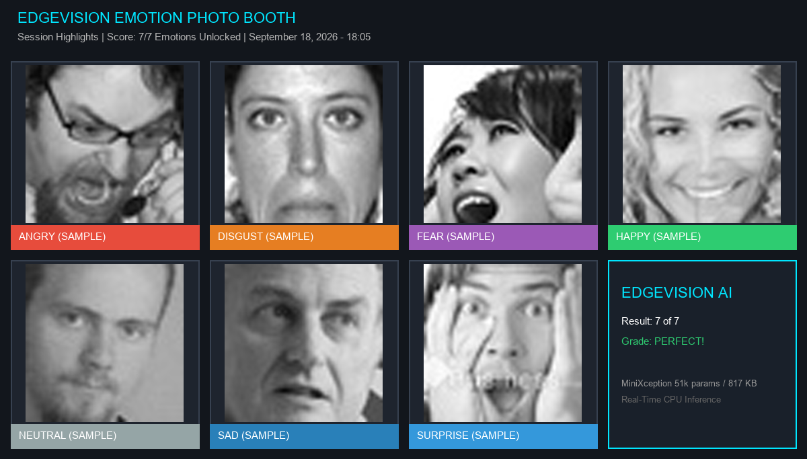

# 🎭 EdgeVision: Real-Time Facial Emotion & Driver Fatigue Guard

[](https://github.com/shahin13700/fer-emotion-recognition/actions)
[](https://opensource.org/licenses/MIT)
[](https://www.python.org/)
[](https://tensorflow.org/)
[](https://developers.google.com/mediapipe)
[](https://gradio.app/)
[]()

A lightweight, CPU-only computer vision pipeline for **real-time facial emotion recognition**, a **gamified photo booth**, and **driver drowsiness monitoring**. No GPU required.

Powered by a compact **MiniXception CNN** (51,255 parameters, 817 KB) trained on FER2013 with class-balanced weights, stabilized by **Exponential Moving Average (EMA) temporal smoothing**, and paired with the **Google MediaPipe Face Landmarker** (478 landmarks, Tasks API) for eye-closure detection.

---

## 🌟 Key Features

- ⚡ **Fast CPU Inference:** Depthwise separable convolutions keep the model at 51k parameters. The forward pass is graph-compiled (`tf.function`), so a face costs **~2 ms** and a full 640×480 frame (Haar detection + classification) **~5 ms** on a desktop CPU (measured on a Ryzen 5000; your webcam and browser will bound the real frame rate).
- 📸 **7-Emotion Photo Booth Challenge:** Interactive webcam challenge with **peak expression tracking**: any emotion scored above a 25% floor is captured, and each slot upgrades whenever you beat your personal best. Produces a downloadable **Emotion Photo Strip**. Only the largest (primary) face in frame is tracked, so bystanders never end up in your strip.
- 💾 **Local Personal Dataset Builder:** Opt-in saving of your captured faces to `dataset/user_contributed/` (with an append-only `metadata.jsonl`) so you can adapt the model to your camera, lighting, and face. Labels default to the model's own top prediction (self-training), so the booth has a **relabel** control to correct them before saving; each capture is saved exactly once. **Automatically disabled on Hugging Face Spaces** so visitors' faces are never written to a shared server.
- 🛡️ **Guardrailed Fine-Tuning (`fine_tune.py`):** Trains on the exact tight crops the model classified (no train/serve skew), blends them into every batch with augmentation and the same class-balanced weights as the base model, ignores byte-identical duplicates, requires ≥10 unique faces per class, and holds out 20% of your faces. A candidate is promoted only if it does not regress on your held-out faces, loses at most 1 pp accuracy and macro-F1 on FER2013, and no single class loses more than 3 pp recall. Previous weights are always backed up.
- 👁️ **Fatigue & Drowsiness Guard:** Real-time **Eye Aspect Ratio (EAR)** from MediaPipe landmarks flags sustained eye closure. Uses the current MediaPipe Tasks API (`FaceLandmarker`); the ~3.7 MB landmark model is downloaded to `model/` on first run.
- 🎯 **Temporal Smoothing:** EMA across consecutive frames in every live path (Gradio webcam tabs, `demo.py`, `monitor.py`, uploaded videos) reduces label flicker.
- 🧠 **Explainable AI (Grad-CAM):** Coarse activation maps showing which region of the face drove a prediction.
- 🌐 **Interactive Web App (Gradio):** Photo booth, live webcam, video upload, and still-image tabs, ready for **Hugging Face Spaces**.

### 📸 Photo Booth Session Strip
The strip below was generated by the shipped code with the seven benchmark fallback faces (hence the `(SAMPLE)` tags). Sample tiles deliberately show no confidence number, because the model does not necessarily predict that emotion for them (see the Grad-CAM gallery); a live session shows your own captures with their real scores:



---

## 📊 Benchmark Evaluation

Evaluated with `evaluate.py` on the **7,178-image FER2013 test set** (the Kaggle `msambare/fer2013` split). These numbers are produced by the exact weights in `model/emotion_model.keras`; see [`outputs/classification_report.txt`](outputs/classification_report.txt) and [`outputs/empirical_thresholds.json`](outputs/empirical_thresholds.json).

| Emotion | Precision | Recall | F1-Score | Support | Typical Confidence* | Key Facial Signals |
| :--- | :---: | :---: | :---: | :---: | :---: | :--- |
| **Happy** | **0.85** | **0.75** | **0.79** | 1,774 | 0.71 | Distinctive smile, raised cheeks |
| **Surprise** | **0.67** | **0.75** | **0.71** | 831 | 0.69 | Raised eyebrows, open mouth |
| **Neutral** | 0.49 | 0.61 | 0.55 | 1,233 | 0.46 | Resting facial posture |
| **Angry** | 0.45 | 0.54 | 0.49 | 958 | 0.46 | Lowered eyebrows, tightened lips |
| **Disgust** | 0.40 | 0.61 | 0.48 | 111 | 0.71 | Wrinkled nose (class-weighted) |
| **Sad** | 0.48 | 0.42 | 0.45 | 1,247 | 0.37 | Downturned lip corners; often predicted Neutral |
| **Fear** | 0.41 | 0.30 | 0.34 | 1,024 | 0.39 | Widened eyes; confused with Sad, Angry, Surprise |

- **Test Accuracy:** **57.3%** (macro F1 0.54, weighted F1 0.57). This is in line with published MiniXception results on FER2013 for a ~50k-parameter model; human agreement on this dataset is roughly 65% because of label noise.
- **\*Typical Confidence:** the 25th percentile of the model's confidence on *correct* test predictions (`scripts/calc_percentiles.py`). Shown in the app as a reference for what a strong score looks like; it is **not** a capture gate.

---

## 🔬 Explainable AI: Grad-CAM

`explain.py` generates Gradient-weighted Class Activation Maps from the last residual block. That block's feature map is **3×3**, so each heatmap is a coarse attribution grid upsampled to the 48×48 input: it tells you *which region* of the face contributed most, not fine detail. The gallery also flags misclassified samples (✗) rather than hiding them; on the seven bundled samples the model gets 4/7 right, consistent with its 57% test accuracy.


---

## 🚀 Quickstart

### 1. Installation
```bash
git clone https://github.com/shahin13700/fer-emotion-recognition.git
cd fer-emotion-recognition

# Create virtual environment (Python 3.11)
python -m venv .venv
source .venv/bin/activate       # On Linux/macOS
.\.venv\Scripts\Activate.ps1    # On Windows

# Install dependencies
pip install -r requirements.txt
```

*(Pre-trained weights are included in `model/emotion_model.keras`, no training required. On Debian/Ubuntu without a desktop, `apt install libgl1 libglib2.0-0` for OpenCV; `packages.txt` does this on Hugging Face Spaces.)*

### 2. Available Scripts

* **Interactive Web App & Photo Booth:**
  ```bash
  python app.py
  ```
  *Open `http://127.0.0.1:7860` in your browser.*

* **Real-Time Live Webcam (OpenCV window, EMA-smoothed):**
  ```bash
  python demo.py
  ```

* **Driver Fatigue & Drowsiness Guard (MediaPipe):**
  ```bash
  python monitor.py    # downloads model/face_landmarker.task (3.7 MB) on first run, or set EDGEVISION_LANDMARKER_PATH
  ```

* **Explainable AI (Grad-CAM Heatmaps):**
  ```bash
  python explain.py
  ```

* **Local Active Learning Fine-Tuning** (requires FER2013 in `dataset/`, see below, plus ≥10 unique saved faces per class):
  ```bash
  python fine_tune.py                 # --max_test_drop 0.01 --max_class_drop 0.03 by default
  python fine_tune.py --reset         # restore the original weights anytime
  ```
  The FER2013 test set acts as a regression guard here, which is a mild form of model selection on the test set; do not quote a post-fine-tune test accuracy as a benchmark result.

* **Evaluate / Retrain the Base Model:**
  ```bash
  # Download and unpack FER2013 (needed by evaluate.py, fine_tune.py, train.py)
  kaggle datasets download -d msambare/fer2013
  unzip -q fer2013.zip -d dataset/
  python evaluate.py     # reproduces outputs/classification_report.txt
  python train.py        # retrains from scratch (same architecture/regularization as the shipped model; results vary by run)
  ```
  The shipped weights came from a Colab run of `notebooks/exploration_and_training.ipynb`; its outputs and training log were not preserved, so `train.py` is the maintained way to reproduce a comparable model.

---

## 🔒 Privacy

- The webcam tabs process frames in memory and store nothing unless you tick the consent box in the Photo Booth and click **Save**.
- Saved crops go to `dataset/user_contributed/` on the machine running the app and are never uploaded by EdgeVision. Delete that folder to erase them. `dataset/` is git-ignored.
- On Hugging Face Spaces (`SPACE_ID` set) saving is disabled by default because the "machine running the app" is a shared server. Set `EDGEVISION_ALLOW_SAVE=1` only on a private deployment you control.
- Uploaded videos are capped (default 50 MB, first 1,800 frames, downscaled to 640 px). Annotated outputs and Gradio's own cached copies of uploads and results are purged after an hour (`gr.Blocks(delete_cache=...)`). Tune with `EDGEVISION_MAX_UPLOAD` and `EDGEVISION_MAX_VIDEO_FRAMES`.
- Saved records carry `label_source` (`model_argmax` or `user_corrected`) and `consent_given`; nothing is "verified" beyond that.

---

## 🔮 Roadmap

1. ⚡ **ONNX Runtime & INT8 Quantization:** Export to ONNX / TFLite and benchmark on Raspberry Pi-class CPUs.
2. 👁️ **3D Head Pose Filtering:** Use MediaPipe FaceMesh pose to reject extreme off-angle faces before classification.
3. 🧪 **Cleaner data:** FER2013 label noise caps accuracy near 65%; RAF-DB or AffectNet would lift the ceiling.

---

## 📁 Repository Structure

```
├── app.py                         # Gradio web app (Photo Booth, webcam, video, image, local active learning)
├── fine_tune.py                   # Guardrailed active learning fine-tuning engine
├── demo.py                        # Real-time webcam demo with EMA temporal smoothing (OpenCV window)
├── monitor.py                     # MediaPipe Face Landmarker + Drowsiness (EAR) monitor
├── explain.py                     # Grad-CAM Explainable AI generator
├── train.py                       # Base model training script (matches the shipped model's architecture)
├── evaluate.py                    # Evaluation suite & confusion matrix generator
├── packages.txt                   # System packages for Hugging Face Spaces (libGL for OpenCV)
├── CONTRIBUTING.md                # Development setup & contribution guide
├── assets/
│   ├── sample_photo_strip.png     # Strip generated from the benchmark fallback faces
│   └── samples/                   # Seven 48x48 FER2013 test faces used as UI fallbacks
├── docs/
│   └── academic_research_report.md # Course report (methodology, results, lessons learned)
├── notebooks/
│   └── exploration_and_training.ipynb # Colab notebook behind the shipped weights (outputs not preserved)
├── scripts/
│   └── calc_percentiles.py        # Computes per-class typical-confidence percentiles
├── model/
│   └── emotion_model.keras        # Trained weights (51,255 params, 817 KB); fine_tune.py backups and face_landmarker.task land here (git-ignored)
├── outputs/
│   ├── class_indices.json         # Emotion class label index mapping
│   ├── classification_report.txt  # evaluate.py output for the shipped weights
│   ├── empirical_thresholds.json  # Per-class confidence percentiles on correct test predictions
│   └── gradcam_samples/           # Grad-CAM gallery
├── tests/
│   └── test_active_learning.py    # Automated test suite (38 tests)
├── requirements.txt               # Pinned Python package dependencies
├── LICENSE                        # MIT License (code and weights)
└── README.md
```

---

## 📜 License & Data

Code and trained weights are distributed under the **MIT License** (see `LICENSE`). The seven images in `assets/samples/` are 48×48 crops from the FER2013 test set, which was assembled from web image search results; they are included for demonstration only and are not covered by the MIT license.
